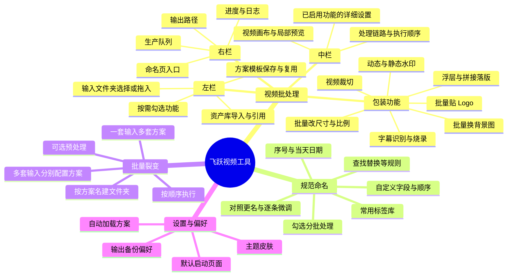
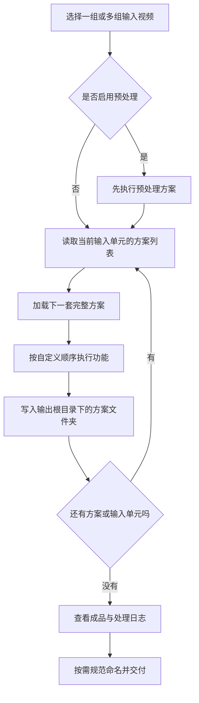

<h1 align="center">飞跃视频工具 · Freya</h1>

<p align="center"><strong>把重复的视频包装留给工具，把时间留给创作。</strong></p>

<p align="center">
  <a href="https://sasafreya.github.io/feiyue-video-tools/">官网与交互演示</a> ·
  <a href="https://github.com/SasaFreya/feiyue-video-tools/releases/tag/v24.0.0">下载安装包</a> ·
  <a href="#快速上手">快速上手</a> ·
  <a href="#常见问题">常见问题</a> ·
  <a href="https://github.com/SasaFreya/feiyue-video-tools/issues">反馈问题</a>
</p>

**飞跃是一款在自己电脑上运行的视频批量处理工具**，围绕视频包装、规范命名与多方案输出，把重复步骤保存为可复用的方案。

例如，你剪好了一个文件夹的视频，需要统一加 Logo、水印和落版，再输出几套不同比例的包装。你可以先配置方案，以后直接套用；同一组素材也可以按多套方案分别处理，自动建立输出子文件夹。

视频读取与导出在本地完成，无需把素材上传到网站。本仓库提供产品介绍、官网页面和安装包下载，**桌面工具源代码不公开**。

## 适合谁

- **信息流与买量视频剪辑师**：重复添加品牌包装，交付多套方案。
- **内容创作者**：统一 Logo、声明水印和片尾，减少逐条操作。
- **团队素材管理人员**：按字段与标签规范命名，整理不同方案的输出。

## 功能全景



## 核心功能

### 视频批处理：一套包装，多次复用

| 功能 | 可以做什么 |
|---|---|
| 视频裁切 | 保留或删除指定时间段，处理末尾的 N 秒 |
| 批量改尺寸与比例适配 | 对同批视频统一调整输出尺寸或比例，以模糊背景承接原视频画面 |
| 动态水印 | 导入动态水印素材，配置位置与相关参数 |
| 静态水印与 Logo | 添加品牌 Logo 或声明图片，调整位置与大小 |
| 浮层落版 | 在结尾前叠加落版素材，与原视频画面重叠展示 |
| 拼接落版 | 正片结束后接落版，可保留落版原声 |
| 批量换背景图 | 在可视化叠加中使用自备背景图或背景视频，制作 9:16、16:9、1:1、4:5 等包装布局 |
| 批量贴 Logo | 在可视化叠加中统一 Logo 位置，也可针对每条视频单独微调 |
| 方案模板 | 保存功能配置与素材路径，后续重复使用 |
| 局部预览 | 先检查开头、中间或结尾的处理效果，再批量导出 |

功能可以按需勾选，执行顺序可以调整。字幕相关功能仍在完善中，使用范围和限制见下方说明。

### 预览与素材复用

选中输入视频后，可在中间画布查看预览帧，辅助判断画面与包装的位置；支持放大查看。智能预览或手动选择短片段，可以检查开头、中间或最后约 3 秒的处理效果。

资产库可以导入常用素材或引用素材路径；方案模板保存配置，方便下一次复用。动态水印涉及背景色与透明度时，可检查颜色保护设置，避免水印发灰或发黑。

### 字幕：识别大意与批量烧录

- 识别阿拉伯语、土耳其语等视频语音，导出 SRT，辅助理解视频大意。
- 使用一份已有 SRT，为同批视频烧录相同字幕。
- 多份 SRT 匹配对应视频后烧录字幕。

作者在无背景音乐的阿语、土语素材上体验到约 80% 的识别准确率；这是特定素材的使用反馈，并非标准评测或效果保证。口音、音乐和录音质量都会影响结果，需要人工核对。识别功能需要额外的 Whisper 环境，安装包不内置模型。

字幕暂不作为裂变分支直接支持的步骤；需要时在单方案批处理或预处理阶段配置。

### 规范命名：把交付规则变成模板

- 自定义命名字段及字段顺序，组合序号、品牌、日期、作者和标签。
- 日期可随电脑日期更新，常用标签可维护和复用。
- 对照查看原文件名与新文件名，确认后执行；个别条目可微调。
- 支持对照更名及附加命名等方式，适配不同整理习惯。

命名会修改文件名，第一次使用建议先拿复制的素材文件夹试跑，并检查预览结果。

### 批量裂变：一组素材，输出多套完整方案

每个分支是一套完整方案，而不是单独一个功能。可以引用已有模板，也可以保存自己的组合。

```text
一组输入视频
    ├── 方案 A：水印 → 落版 → 1:1 背景包装
    ├── 方案 B：水印 → 落版 → 16:9 背景包装
    └── 方案 C：自定义功能与执行顺序

输出根目录/
    ├── 方案 A/
    ├── 方案 B/
    └── 方案 C/
```

上面是工作流示例，实际尺寸、素材和执行顺序由你配置。支持组织多个输入单元，并按方案自动建立输出文件夹；需要先统一处理素材时，可配置预处理方案。

### 多方案处理流程



### 队列、监视与使用偏好

生产队列用于把多次批处理或裂变任务排好顺序。监视文件夹可以扫描子文件夹并加入队列，实际处理仍需启动队列；不是开启监视后就自动完成所有导出。

设置中可以记住默认启动页面、自动加载方案等使用偏好，并选择奶油粉白、蓝白、黄绿、黑紫等主题。队列与监视属于进阶功能，第一次使用建议从普通单方案批处理开始。

## 后续构想

以下是作者提出的产品方向，**不代表当前下载包已经提供，也不承诺发布时间**：

| 方向 | 构想 |
|---|---|
| 桌面体验 | 探索 Electron 工作台与画布交互版本 |
| 网页体验 | 探索 PWA 形式的应用体验 |
| 画质处理 | 探索画质增强能力 |
| 字幕完善 | 改善识别、匹配与烧录流程 |

当前版本以本地桌面包装流程为主，官网交互演示的功能范围见下方说明。

## 下载与安装

**[下载当前 macOS Apple Silicon 安装包](https://github.com/SasaFreya/feiyue-video-tools/releases/download/v24.0.0/FeiyueVideoTool_macOS_AppleSilicon.zip)**

| 平台 | 当前状态 |
|---|---|
| macOS Apple Silicon（M 系列芯片） | 当前提供的安装包 |
| macOS Intel | 当前未提供单独的 Intel 安装包 |
| Windows | 当前发布页未提供 Windows 安装包，后续以 Releases 为准 |

发布页中的文件说明：

| 文件 | 用途 |
|---|---|
| `FeiyueVideoTool_macOS_AppleSilicon.zip` | 推荐下载的当前安装包 |
| `FeiyueVideoTool_macOS.zip` | 当前安装包的兼容文件名，与推荐包内容相同 |
| `FeiyueVideoTool_macOS_legacy.zip` | 旧版备份，通常无需下载 |

### macOS 安装步骤

1. 下载并解压 ZIP，保持包内配套文件的相对位置。
2. 找到 `飞跃视频工具.app`，首次尝试右键 → **打开**。
3. 若系统拦截，查看 **系统设置 → 隐私与安全性** 中是否提供“仍要打开”，按系统提示操作。当前安装包尚未经过 Apple 公证，具体提示随 macOS 版本不同。
4. 启动后先用少量测试素材检查输入、预览和输出，再处理正式任务。

无需为了使用安装包克隆仓库或配置 Python 开发环境。GitHub 自动生成的 “Source code” ZIP/TAR 是仓库文件，不是桌面安装包。

## 快速上手

### 先做一套可复用方案

1. 在「视频批处理」中选择输入文件夹，也可以尝试拖入文件夹。
2. 勾选需要的功能，选择 Logo、背景图或落版等素材。
3. 调整参数与执行顺序，选择独立的输出目录。
4. 预览相关片段，检查位置、比例、结尾与声音。
5. 将配置保存为方案模板，开始处理。下次加载模板即可复用。

模板记住的素材路径需要继续有效；素材被移动或删除后，应重新选择路径。

### 再做多方案输出

1. 进入「批量裂变」，添加输入单元。
2. 为单元选择多套方案，需要时设置预处理。
3. 检查方案名称、输入位置和输出根目录。
4. 开始执行，到各方案子文件夹查看成品。

需要统一交付命名时，可以使用「规范命名」页面，先检查原名与新名的对照结果。

## 官网与演示

**[打开飞跃官网](https://sasafreya.github.io/feiyue-video-tools/)**

官网提供功能介绍、产品宣传片、交互演示和下载入口。交互演示使用示例素材展示布局与流程；**完整的视频编码与文件夹批量导出由桌面工具执行**。

## 常见问题

### 素材会上传到服务器吗？

桌面视频包装流程读取本地素材，将成品写入你指定的本地输出目录，无需上传视频到官网。

### 这是 AI 视频生成工具吗？

当前主要功能是视频包装、规范命名和批量工作流。它不提供网页演示中直接生成完整视频的 AI 服务。

### 浮层落版和拼接落版有什么区别？

浮层落版在正片结束前叠加，与原画面重叠；拼接落版接在正片结束之后。需要落版自己的声音时，检查保留落版原声的设置，并通过结尾预览确认。

### 拖入文件夹没有反应怎么办？

先使用界面的文件夹选择按钮，确认选中的是有效文件夹，并尝试一个只含少量视频的本地目录。若按钮选择也失败，请记录系统版本、操作步骤和日志，提交反馈。

### 打开空白、启动退出或导出失败怎么办？

确认已完整解压，并检查是否有系统拦截提示。若仍失败，请通过 Issues 提供复现步骤、错误截图和可用日志；导出问题请补充视频格式、启用功能及失败发生的位置。反馈材料请去除私人素材、邮箱以外的敏感账号信息和其他不希望公开的内容。

## 使用许可与源码范围

- 安装包供个人与团队内部免费使用。
- 不得将安装包转售或冒充官方二次分发。
- 公开仓库中的官网文件不代表桌面工具源码已开源，也不代表桌面安装包采用开源许可。
- 流程微调、命名字段规则等定制需求，可以联系作者讨论。

## 反馈与联系

- **问题与功能建议**：[GitHub Issues](https://github.com/SasaFreya/feiyue-video-tools/issues)
- **联系邮箱**：[3270801877@qq.com](mailto:3270801877@qq.com)
- **作者**：[SasaFreya](https://github.com/SasaFreya)

反馈时尽量说明：系统及芯片、安装包名称、操作步骤、预期结果、实际结果，以及截图或错误日志。这些信息有助于定位问题。

如果工具帮你省下了重复操作的时间，欢迎在 GitHub 点一个 ⭐ Star，或把官网分享给有同样需求的人。
